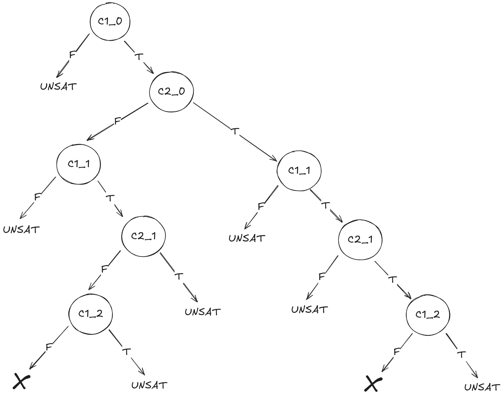

## Ejercicio 1

#### a)

Si reemplazamos `r = r+1` por `r = -abs(r+1)`, entonces el test case:  
- `assertEqual(test_me(0,0), 2)`
pasa en la función original, pero no en el mutante, ya que, en las dos iteraciones, ejecuta:  
1. `r = - abs(0 + 1) = - abs(1) = -1`  
2. `r = - abs(-1 + 1) = = - abs(0) = 0`   
Luego, el mutante retorna 0 en vez de 2.
#### b)
Sirven varias, por ejemplo:
- `abs(i) < 2`  equivalente a `i < 2` 
- `r = abs(r+1)`  equivalente a `r = r + 1`  
- `return abs(r)` equivalente a `return r`

---
## Ejercicio 2

#### a)

| Iteracion | Input concreto | Condición de ruta                        | Fórmula para el sat solver            | Resultado posible |
| --------- | -------------- | ---------------------------------------- | ------------------------------------- | ----------------- |
| 1         | k = 0, j = 0   | 0<2 y k0=j0 y 1<2 y k0=j0 y !(2<2)       | 0<2 yk0=j0 y 1<2 y k0=j0 y 2<2        | UNSAT             |
|           |                |                                          | 0<2 y k0=j0 y 1<2 y !(k0=j0)          | UNSAT             |
|           |                |                                          | 0<2 y k0=j0 y !(1<2)                  | UNSAT             |
|           |                |                                          | 0<2 y !(k0=j0)                        | k0 = 0, j0 = 1    |
| 2         | k = 0, j = 1   | 0<2 y !(k0=j0) y 1<2 y !(k0=j0) y !(2<2) | 0<2 y !(k0=j0) y 1<2 y !(k0=j0) y 2<2 | UNSAT             |
|           |                |                                          | 0<2 y !(k0=j0) y 1<2 y k0=j0          | UNSAT             |
|           |                |                                          | 0<2 y !(k0=j0) y !(1<2)               | UNSAT             |
|           |                |                                          | !(0<2)                                | UNSAT             |
|           |                |                                          | FIN                                   |                   |

#### b)

| Árbol de cómputo de la exploración simbólica dinḿica |
| ---------------------------------------------------- |
|                          |

---

## Ejercicio 3

#### a)

Una branch distance es mayor que 0 si y solo si nunca se siguió su camino del `false`. Es decir, nunca se tomó la condición como falsa. Por lo tanto, decir que la branch distance del `false` de la condición `#C1` es mayor que 0, significaría que el ciclo nunca terminó (es decir, siempre se eligió la rama del `true` de la condición del ciclo).  

Pero esto último no puede ocurrir, ya que el código está bien definido, se hacen solo 2 iteraciones, y la tercera vez que se lee la condición del ciclo dará `false`. Por lo tanto, no existe el test suite pedido.

#### b)
La distancia de branches no normalizada para el test 1 (y por lo tanto para el test suite) es:

| Branch             | Distance True | Distance False |
| ------------------ | ------------- | -------------- |
| C1 = `while i < 2` | 0             | 0              |
| C2 = `if k==j:`    | 1             | 0              |

Las branches son C1, !C1, C2, !C2.  
La única branch no cubierta es C2, por lo tanto, el branch coverage es de 0.75.

---
## Ejercicio 4

```python
def parse_email(email: str) -> List[Optional[str]]:
    parts = email.split('@') # 0
    if len(parts) != 2: # 1
        return [None, None, None]
    else: # 2
        local_part, domain = parts
        if not local_part: # 3
            return [None, None, None]
        else: # 4
            if not domain or '.' not in domain: # 5
                return [None, None, None]
            else: # 6
                last_dot_index = domain.rfind('.')
                domain_part = domain[:last_dot_index]
                top_level_domain = domain[last_dot_index + 1:]
                return [local_part, domain_part, top_level_domain]
```
#### a)
| Emails                                 | Camino     | Freq. actual de camino | Freq. final de camino | Energía     |
| -------------------------------------- | ---------- | ---------------------- | --------------------- | ----------- |
| #1 `user@example.com`                  | 0, 2, 4, 6 | 1                      | 7                     | $1/7^3$     |
| #2 `john.doe@example.co.uk`            | 0, 2, 4, 6 | 2                      | 7                     | $1/7^3$     |
| #3 `alice.smith@subdomain.example.org` | 0, 2, 4, 6 | 3                      | 7                     | $1/7^3$     |
| #4 `info@company.com`                  | 0, 2, 4, 6 | 4                      | 7                     | $1/7^3$     |
| #5 `support@sub.subdomain.example.net` | 0, 2, 4, 6 | 5                      | 7                     | $1/7^3$     |
| #6 `invalid-email`                     | 0, 1       | 1                      | 2                     | $1/2^3$     |
| #7 `missing_domain@`                   | 0, 2, 4, 5 | 1                      | 2                     | $1/2^3$     |
| #8 `@missing_local_part.com`           | 0, 2, 3    | 1                      | 1                     | $1/1^3 = 1$ |
| #9 `missing_local_part_and_domain`     | 0, 1       | 2                      | 2                     | $1/2^3$     |
| #10 `user@[IPv6:2001:db8::1]`          | 0, 2, 4, 5 | 2                      | 2                     | $1/2^3$     |
| #11 `user+tag@example.com`             | 0, 2, 4, 6 | 6                      | 7                     | $1/7^3$     |
| #12 `john.smith@subdomain.example.org` | 0, 2, 4, 6 | 7                      | 7                     | $1/7^3$     |
#### b)
Probabilidad de elegir input #3: $$\frac{e(input_3)}{\sum_i e_i} = \frac{1/7^3}{1/7^3 \times 7 + 1/2^3 \times 4 + 1}$$
