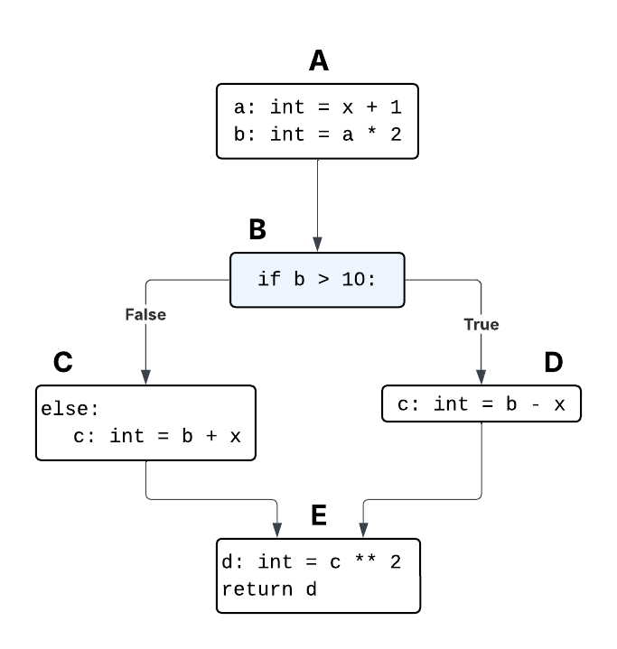
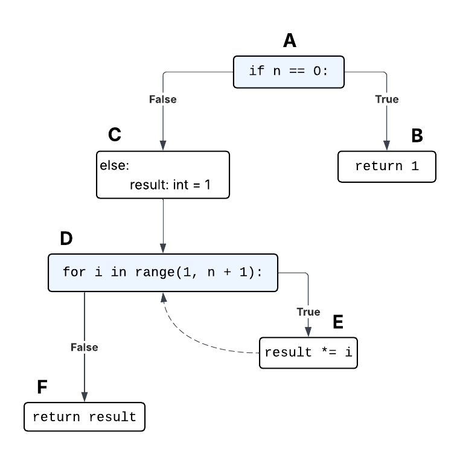
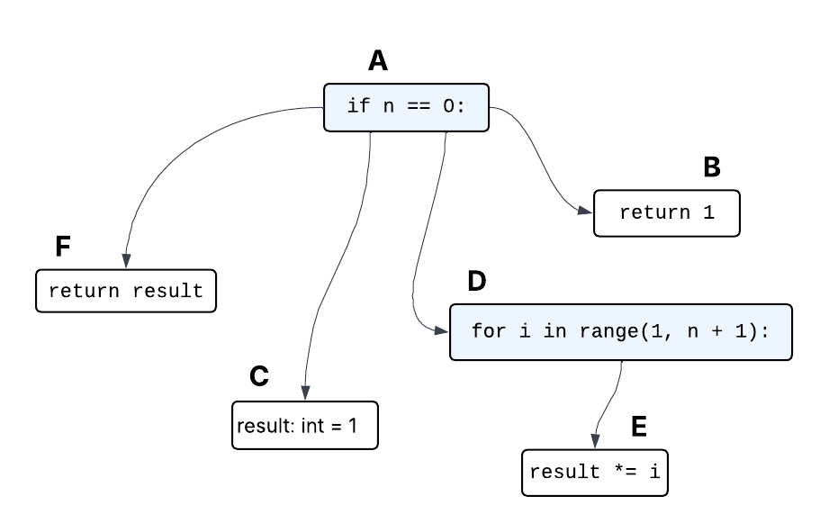

## Ejercicio 1
```python
def testme(n: int) -> int:
    r: int = 0
    if n >= 0:  # C1
        i: int = 0
        while i < n:  # C2
            if i % 2 == 1:  # C3
                r = r + i
            i = i + 1
    return r


class TestSuite(unittest.TestCase):
    def test1(self):
        self.assertEqual(0, testme(-1000))
    
    def test2(self):
        self.assertEqual(0, testme(0))
    
    def test3(self):
        self.assertEqual(0, testme(1))
```
### a) Asumiendo un $K=1$ ¿Cuál es el valor de la distancia de branch no normalizada para cada decisión si ejecutamos el test suite?

Las branch distances para cada test case son:  


| test1 | distancia True | distancia False |
| ----- | -------------- | --------------- |
| C1    | $1000$         | $0$             |
| C2    | $\infty$       | $\infty$        |
| C3    | $\infty$       | $\infty$        |

| test2 | distancia True | distancia False |
| ----- | -------------- | --------------- |
| C1    | $0$            | $1$             |
| C2    | $1$            | $0$             |
| C3    | $\infty$       | $\infty$        |

| test3 | distancia True | distancia False |
| ----- | -------------- | --------------- |
| C1    | $0$            | $2$             |
| C2    | $0$            | $0$             |
| C3    | $1$            | $0$             |

Luego, para todo el test suite (tomando el mínimo de cada uno), nos queda:

| test suite | distancia True | distancia False |
| ---------- | -------------- | --------------- |
| C1         | $0$            | $0$             |
| C2         | $0$            | $0$             |
| C3         | $1$            | $0$             |
### b) ¿Cuál es el cubrimiento de líneas?

Hay un cubrimiento de líneas de $7/8$, pues la línea que corresponde al cuerpo de la condición C1 no es cubierta por ningún test case.

### c) ¿Cuál es el cubrimiento de branches?

Las branches son:
- not C1
- C1 and not C2
- C1 and C2 and not C3
- C1 and C2 and C3

La última no es cubierta por el test suite, por lo que el cubrimiento de ramas es de $3/4$.

---
## Ejercicio 2

```python
def testme(x: int, y: int) -> bool:
    result: bool = False
    z: int = 2 * y
    if z == x:  # c1
        if x > y + 10:  # c2
            result = True
    return result


class TestSuite(unittest.TestCase):
    def test1(self):
        self.assertEqual(False, testme(0, 0))
    
    def test2(self):
        self.assertEqual(False, testme(1, 1))
    
    def test3(self):
        self.assertEqual(False, testme(2, 2))
```

### a) Completar la tabla con los valores de la distancia de branch no normalizada para cada decisión luego de ejecutar todo el test suite. El valor de $K$ para la distancia de branch es $\text{0.5}$.

Usando $K = 1$:

| test1 | distancia True | distancia False |
| ----- | -------------- | --------------- |
| C1    | $0$            | $1$             |
| C2    | $21$           | $0$             |

| test2 | distancia True | distancia False |
| ----- | -------------- | --------------- |
| C1    | $1$            | $0$             |
| C2    | $\infty$       | $\infty$        |

| test3 | distancia True | distancia False |
| ----- | -------------- | --------------- |
| C1    | $2$            | $0$             |
| C2    | $\infty$       | $\infty$        |

Luego, la branch distance para cada condición para el test suite (nuevamente tomando los mínimos cuadrantes), con $K = 0.5$, es de:

| test3 | distancia True | distancia False |
| ----- | -------------- | --------------- |
| C1    | $0$            | $0$             |
| C2    | $10.5$         | $0$             |

### b) ¿Cuál es el cubrimiento de líneas?

Hay un cubrimiento de líneas de $5/6$, pues la línea que corresponde al cuerpo de la condición C2 no es cubierta por ningún test case.

### c) ¿Cuál es el cubrimiento de branches?

Las posibles branches son:
- not C1
- C1 and not C2
- C1 and C2
Esta última no es cubierta, por lo que el cubrimiento de branches es de $2/3$.

---
## Ejercicio 5

```python
def func(x: int) -> int:
    a: int = x + 1
    b: int = a * 2
    if b > 10:
        c: int = b - x
    else:
        c: int = b + x
    d: int = c ** 2
    return d
```
### a) Escribir el control flow graph

| CFG                   |
| --------------------- |
|  |

### b) Escribir los dominadores y post-dominadores de cada nodo del control flow graph

| Nodo | Dominadores | Post-dominadores |
| ---- | ----------- | ---------------- |
| A    | A           | A, B, E          |
| B    | A, B        | B, E             |
| C    | A, B, C     | C, E             |
| D    | A, B, D     | D, E             |
| E    | A, B, E     | E                |

---
## Ejercicio 7

```python
def factorial(n: int) -> int:
    if n == 0:
        return 1
    else:
        result: int = 1
        for i in range(1, n + 1):
            result *= i
        return result
```

### a) Escribir el control flow graph

| CFG                   |
| --------------------- |
|  |

### b) Escribir los dominadores y postdominadores de cada nodo del control flow graph

| Nodo | Dominadores | Post-dominadores |
| ---- | ----------- | ---------------- |
| A    | A           | A                |
| B    | A, B        | B                |
| C    | A, C        | D, F             |
| D    | A, C, D     | C, D, F          |
| E    | A, C, D, E  | E, D, F          |
| F    | A, C, D, F  | F                |

### c) Escribir el grafo de control dependencia


| Dependence Control Graph |
| ------------------------ |
|       |

---

## Ejercicio 8

> TODO: d) Calcular las distancias en el grafo de control dependencia al target (approach level) de los siguientes inputs