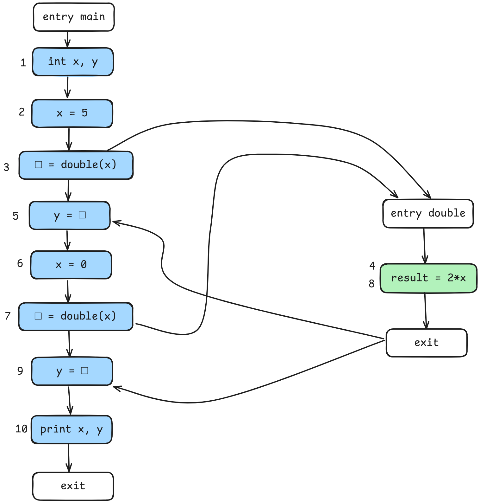

## Ejercicio 1

#### a) Calcular el CFG de main y double

| CFG                           |
| ----------------------------- |
|  |
### b) Calcular el análisis interprocedural usando el dominio del signo sin contextos.

| Nodo n | IN[n]         | OUT[n]         |                                                                   |
| ------ | ------------- | -------------- | ----------------------------------------------------------------- |
| 1      | [x→⊥, y→⊥]    | [x→⊤, y→⊤]     |                                                                   |
| 2      | [x→⊤, y→⊤]    | [x→+, y→⊤]     |                                                                   |
| 3      | [x→+, y→⊤]    | [x→+, y→⊤]     |                                                                   |
| 4      | [x→+] U [x→⊥] | [x->+, res→+]  | Tiene la entrada actual y la otra entrada indefinida (la de 7->8) |
| 5      | [x→+, y→⊤]    | [x→+, y→+]     |                                                                   |
| 6      | [x→+, y→+]    | [x→0, y→+]     |                                                                   |
| 7      | [x→0, y→+]    | [x→0, y→+]     |                                                                   |
| 8      | [x→0] U [x→+] | [x->⊤, res->⊤] | Tiene la entrada actual y la otra de antes (3->4)                 |
| 9      | [x→0, y→+]    | [x→0, y→⊤]     |                                                                   |
| 10     | [x→0, y→⊤]    | [x→0, y→⊤]     |                                                                   |

>Para la unión de elementos: como el análisis de signo es un análisis MAY, se aplica el supremo  

### c) Qué valor calcula el análisis para el print?

Calcula [x→ , y→ ]

### d) Recalcular el dataflow luego de aplicar cloning a la función doble.

| Nodo n | IN[n]      | OUT[n]         |
| ------ | ---------- | -------------- |
| 1      | [x→⊥, y→⊥] | [x→⊤, y→⊤]     |
| 2      | [x→⊤, y→⊤] | [x→+, y→⊤]     |
| 3      | [x→+, y→⊤] | [x→+, y→⊤]     |
| 4      | [x→+]      | [x->+, res→+]  |
| 5      | [x→+, y→⊤] | [x→+, y→+]     |
| 6      | [x→+, y→+] | [x→0, y→+]     |
| 7      | [x→0, y→+] | [x→0, y→+]     |
| 8      | [x→0]      | [x->0, res->0] |
| 9      | [x→0, y→+] | [x→0, y→0]     |
| 10     | [x→0, y→0] | [x→0, y→0]     |

### e) Recalcular el dataflow usando cadenas de llamadas con k=1.

### f) Recalcular el dataflow usando functional context.