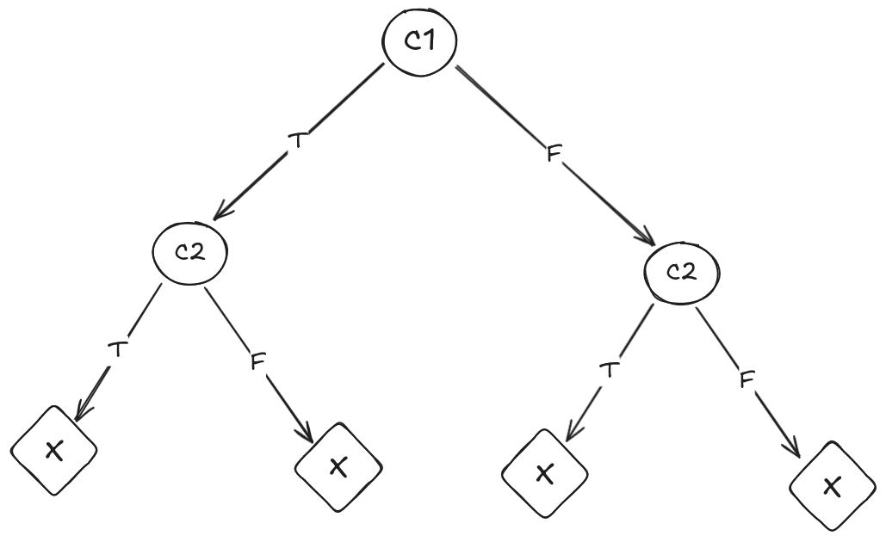
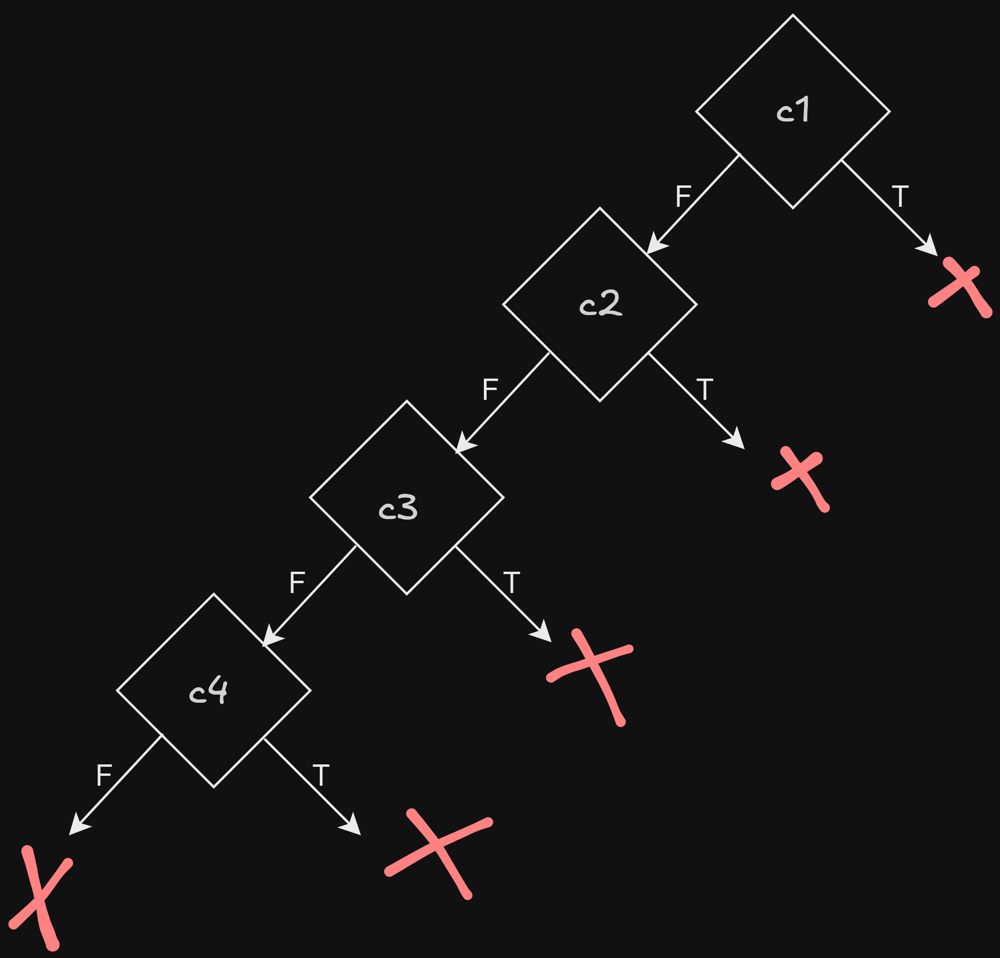

## Ejercicio 4

| Árbol de cómputo |
|--------------------|
|  |

---

## Ejercicio 5

### a)

| Iteración | Input Concreto     | Condición de Ruta                           | Especificación para Z3 | Resultado Z3         | Renombres                                               |
|-----------|--------------------|---------------------------------------------|-------------------------|----------------------|----------------------------------------------------------|
| 1         | a=0, b=0, c=0      | c1                                          | iteracion1.smt          | a=1, b=1, c=1        | c1 = (a <= 0 or b <= 0 or c <= 0)                        |
| 2         | A=1, b=1, c=1      | Not c1 and not c2 and c3                   | iteracion2.smt          | A=4, b=3, c=2        | c2 = (not (a + b > c and a + c > b and b + c > a))      |
| 3         | A=4, b=3, c=2      | Not c1 and not c2 and not c3 and not c4   | iteracion3.smt          | A=2, b=3, c=2        | c3 = (a == b and b == c)                                |
| 4         | A=2, b=3, c=2      | Not c1 and not c2 and not c3 and c4       | iteracion4.smt          | A=1, b=1, c=2        | c4 = (a == b or b == c or a == c)                        |
| 5         | A=1, b=1, c=2      | not c1 and c2                              |                         |                      |                                                          |
|           |                    |                                         | END                     |           END           |                                                          |

### b)

Branch coverage del 100%.  

### c)

| Árbol de cómputo |
|--------------------|
|  |

