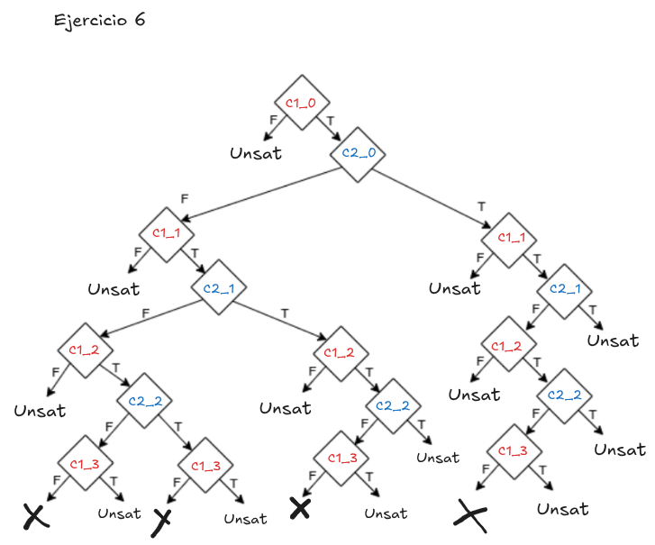
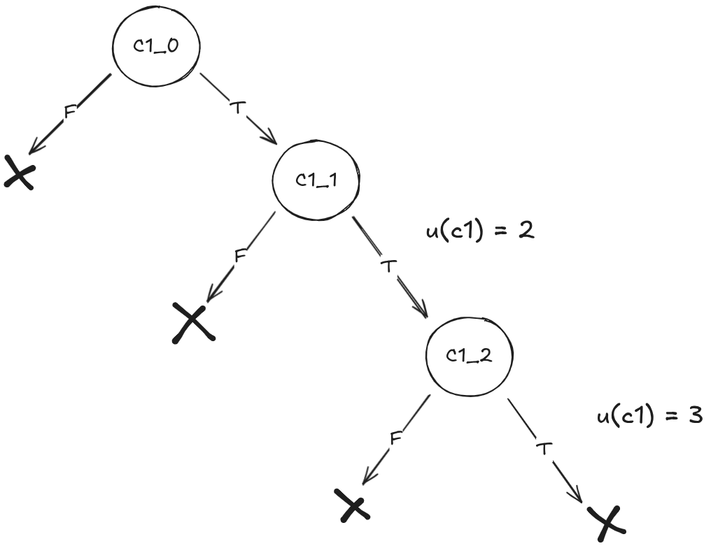

## Ejercicio 4

| Árbol de cómputo |
|--------------------|
|  |

---

## Ejercicio 5

### b)

Branch coverage del 100%.  

### c)

| Árbol de cómputo |
|--------------------|
|  |

--- 

## Ejercicio 6

### b)

**Branch coverage del 100%**.  

### c)

| Árbol de cómputo |
|--------------------|
|  |

--- 

## Ejercicio 7

### b)

| Árbol de cómputo |
|--------------------|
|  |