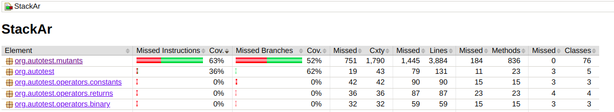
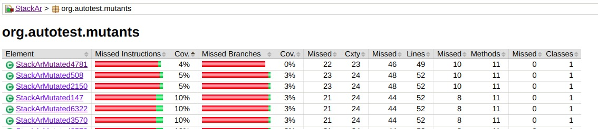

# Taller #1 - Mutation Analysis

## Instrucciones
Completar este documento con las respuestas correspondientes a los ejercicios planteados en el enunciado del taller.

---

## Ejercicio 1: Resultados de generación de mutantes

1. ¿Cuántos mutantes se generaron en total?
   - Respuesta: Se generaron 76 mutantes

2. ¿Qué operador de mutación generó más mutantes? ¿Cuántos y por qué?
   - Respuesta: Counts:
     - Binary: 3 + 3 + 5 = 11
     - Conditionals: 10 + 10 = 20
     - Constants: 7 + 5 + 8 = 20
     - Returns: 3 + 3 + 4 + 6 = 16
     - Unary: 3
    Conditionals y Constants generaron más mutantes. Tiene sentido ya que el código de StackAr tiene muchos condicionales y constantes simples como 1 o 0. Los algoritmos con los que trabaja un stack deben evaluar muchos condicionales, por ejemplo, validar que no se pueda hacer pop cuando el stack está vacío, para instanciar el stack, entre otros. Al mismo tiempo, trabaja con constantes típicas en indexación como 1, 0 o -1 para indices inválidos. Es por esto que estas clases de mutantes generan la mayor cantidad de mutaciones del código original. 

3. ¿Qué operador de mutación generó menos mutantes? ¿Cuántos y por qué?
   - Respuesta: Unary generators, generó 3, ya que se utilizan pocos operadores unarios de ++ y --.

---

## Ejercicio 2: Evaluación de test suites

1. ¿Cuántos mutantes vivos y muertos encontraron cada uno de los test suites?
   - **StackTests1**:
     - Mutantes vivos: 56
     - Mutantes muertos: 20
     - Mutation score: 26%
   - **StackTests2**:
     - Mutantes vivos: 38
     - Mutantes muertos:38
     - Mutation score: 50%

2. ¿Cuál es el mutation score de cada test suite?
   - **StackTests1**: 26%
   - **StackTests2**: 50%

---

## Ejercicio 3: Mejora del test suite

1. ¿Cuál es el mutation score logrado para los tests de StackTests3?
   - Respuesta: 88%

2. ¿Cuántos mutantes vivos y muertos encontraron?
   - Mutantes vivos: 9
   - Mutantes muertos: 67

3. Comente cuáles son todos los mutantes vivos que quedaron y por qué son equivalentes al programa original (si no lo fueran, todavía es posible mejorar el mutation score).
   - Respuesta:
     - `- StackArMutated5196 (FalseConditionalsMutator: Se reemplazó la condición 'isEmpty()' por false en la línea 45.)`. No se puede matar este mutante ya que luego realiza la validación nuevamente en `top()`, haciendo que lance la excepción nuevamente. Por lo tanto, es equivalente.
     - `- StackArMutated1927 (FalseConditionalsMutator: Se reemplazó la condición 'this == obj' por false en la línea 72.)`. Este mutante también es equivalente, ya que el condicional que cambia solo sirve para el caso en que se compara un objeto StackAr consigo mismo. Al no entrar a ese if, va a dar `true` cuando se vea si es equivalente a sí mismo.
     - Los mutantes que respectan al `hashCode`: creemos que son equivalentes ya que hacen que devuelvan un hash diferente, sin romper congruencia entre distintos stacks con sus respectivos hashes (como sí pudimos detectarlo en otro mutante que fue eliminado, mediante un test que en su mutante retornaba iguales hashes para distintos stacks). Son los siguientes:
     ```
         - StackArMutated2023 (MinusOneConstantMutator: Se reemplazó 31 por -1 en la línea 63.)
         - StackArMutated1645 (MinusOneConstantMutator: Se reemplazó 1 por -1 en la línea 64.)
         - StackArMutated2614 (OneConstantMutator: Se reemplazó 31 por 1 en la línea 63.)
         - StackArMutated2011 (MathMutator: Se reemplazó + por - en la línea 65.)
         - StackArMutated5764 (ZeroConstantMutator: Se reemplazó 1 por 0 en la línea 64.)
         - StackArMutated815 (MathMutator: Se reemplazó + por - en la línea 66.)
         - StackArMutated2095 (MathMutator: Se reemplazó * por / en la línea 65.)
       ```
    
4. ¿Cuál es el instruction coverage promedio que lograron para las clases mutadas?
   - Respuesta: 63%
   
| Coverages de mutantes y mutante de menor coverage |
|---------------------------------------------------|
|                      |
|          |

5. ¿Cuál es el peor instruction coverage que lograron para una clase mutada? ¿Por qué creen que sucede esto?
   - Respuesta:
     - `- StackArMutated4781 (TrueConditionalsMutator: Se reemplazó la condición 'capacity < 0' por true en la línea 18.)`. Es fácil ver por que esta clase mutada no tiene tanto coverage de lineas. Como siempre entra al if del tamaño inválido, arroja la excepción, y no cubre el resto de líneas de la clase.
     ```java
         public StackAr(int capacity) throws IllegalArgumentException {
            if (true) { // en vez de if (capacity < 0)
                throw new IllegalArgumentException();
            }
            this.elems = new Object[capacity];
         }
     ```

   
