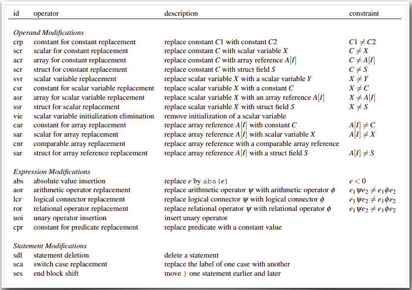

# **Testing**

Las **pruebas de software (software testing)** son una parte esencial del desarrollo de software, ya que permiten verificar que un programa funcione correctamente.

Un problema común es la falta de **especificaciones claras**, lo que lleva a desacuerdos entre desarrolladores y testers sobre qué es correcto. Esto resalta la importancia de tener **especificaciones bien definidas** para evitar malentendidos y retrasos en el proyecto.

En este proceso de desarrollo y pruebas, se debe tener en cuenta lo siguiente:

1. **Especificaciones explícitas**
2. **Independencia entre desarrollo y pruebas**
3. **Recursos limitados**
4. **Evolución de las especificaciones**

### La importancia de las especificaciones

Las pruebas de software son esencialmente una forma de **verificar la consistencia** entre la implementación del programa y sus especificaciones. Sin especificaciones claras, no hay nada que probar. Las especificaciones actúan como una guía que define qué se espera del software, y sin ellas, el proceso de pruebas carece de dirección.

### Niveles de testing

1. **Test de Sistema**: probar el resultado de usar un sistema. Todo el equipo.
2. **Test de Integración**: probar funcionamiento entre unidades/módulos y programadores
3. **Test de Unidad**: chequear comportamiento de una unidad. Mocks. Único programador.
---
## Errores

Una desviación no buscada ni intencional de lo que es correcto, esperado o verdadero:
- **Defecto**: Un error en el **código** del programa, específicamente uno que puede crear un infección (y conducir a una falla)
- **Infección**: Un error en el **estado** del programa, específicamente uno que puede llevar a una falla
- **Falla**: Un error externamente visible en el comportamiento del programa, sobre el **resultado**

### Los 3 desafíos del testing
1. **Disparar el error en cuestión**:
	- ejecutar el defecto
	- hacer que la infección se propague, y
	- resulte en una falla.
2. **Reconocer el error** como tal: lo que es correcto, válido, o verdadero.
3. **Identificar funcionalidad faltante**

---
## **Especificaciones mediante precondiciones y postcondiciones**

Las **precondiciones** y **postcondiciones** son herramientas útiles para definir el comportamiento esperado de una función:

- **Precondiciones**: Condiciones que deben cumplirse sobre la entrada antes de ejecutar una función.
    
- **Postcondiciones**: Condiciones que deben cumplirse después de ejecutar una función.  
    
---

## **Métricas de calidad de las pruebas**

Para evaluar la calidad de una **test suite**, se utilizan dos enfoques principales:

1. **Code Coverage**: Mide el porcentaje de código que ha sido ejecutado durante las pruebas. Incluye métricas como cobertura de funciones, declaraciones, ramas, etc.
    
2. **Mutation Analysis**: Consiste en crear versiones mutadas del código y verificar si las pruebas pueden detectar los cambios. Si una mutación no es detectada, indica que la suite de pruebas puede no ser lo suficientemente robusta.

---
# Coverage: criterios

### 1. Statement Coverage

- **Definición:** Mide el porcentaje de sentencias (líneas de código) ejecutadas durante las pruebas.
- **Objetivo:** Asegurar que **cada línea de código se ejecute** al menos una vez.
### 2. Branch Coverage

- **Definición:** Evalúa si todas las posibles ramas de condiciones (ej. `if-else`, `switch`) han sido ejecutadas.
- **Objetivo:** Asegurar que todas las decisiones lógicas sean probadas en sus **caminos completos** `true` y `false`.

### 3. Edge Testing

- **Definición:** Ejecutar todas las aristas (transiciones de una linea a otra) del CFG al menos una vez.
- **Objetivo:** Cubrir todos los posibles flujos o **transiciones entre bloques de código**, asegurando que se ejecutó todo posible "salto" de una linea a otra.

---
#  Mutation Testing

Técnica  que consiste en realizar pequeños cambios en el código fuente, generando versiones modificadas llamadas **mutantes**.

Los tests **deben ser capaces de distinguir el programa original de los mutantes**.

Cuando una prueba identifica el comportamiento anómalo de un mutante, se dice que **"mata al mutante"**. La **puntuación de mutación** mide la efectividad del conjunto de pruebas en función del porcentaje de mutantes eliminados:
$$\text{Mutation Score} = \frac{\text{Mutantes Muertos}}{\text{Total Mutantes}}$$
Donde los Mutantes Muertos son los detectados y eliminados por el test suite, y el Total de Mutantes es la cantidad total de mutantes generados (mutantes muertos + mutantes vivos).

### **Problemas con Mutation: mutantes equivalentes**

Un problema común en el análisis de mutación es la creación de **mutantes equivalentes**, es decir, mutaciones que no cambian el comportamiento del programa (problema no computable: no se puede decidir si dos programas son equivalentes)

### Meta-mutantes

Técnica que agrupa múltiples mutaciones en una sola versión del programa, optimizando el proceso de mutation testing al reducir el tiempo de compilación y ejecución