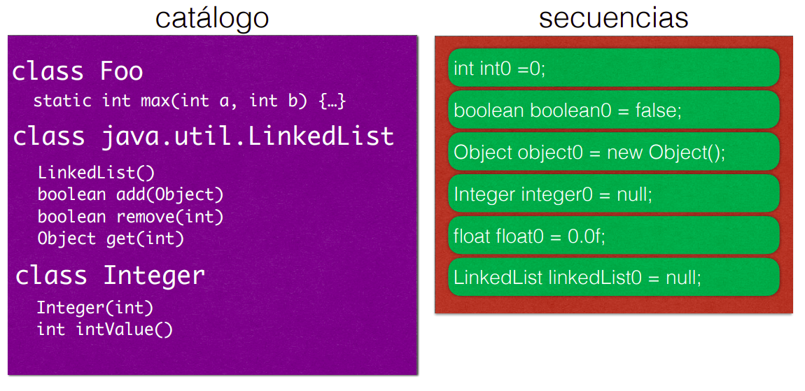
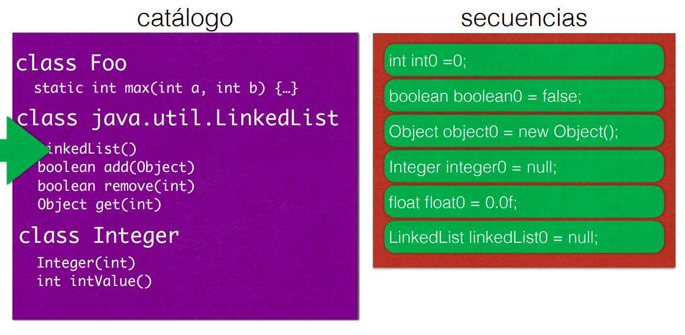
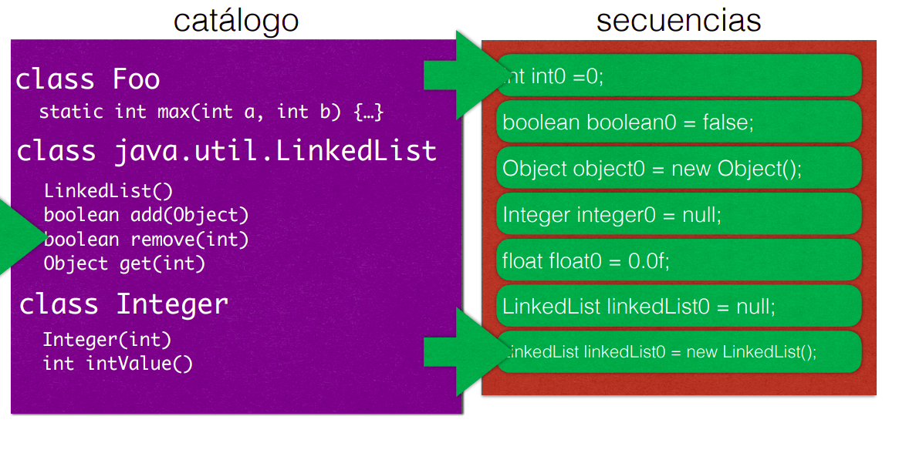
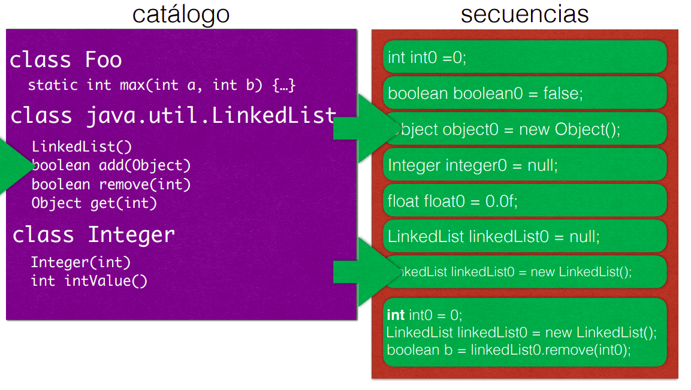
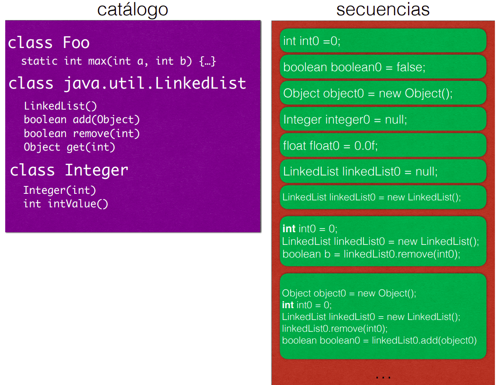

# Random Testing

Dado un "presupuesto" o _budget_ (por ejemplo, 1000 test cases, o 60 segundos de ejecución), **se generan aleatoriamente test cases**, siguiendo el siguiente algoritmo:

```python
# Para M(p0:T0, …, pk:Tk) programa a testear  

RandomDriver(M, budget):
	while budget is not empty:  
		    for each pi: Ti:
		        if Ti is primitive:
			        vi := get random Ti  
		        else:
			        vi := null  
		    add M(v0, …, vk) to tests  
		return tests  
```

---
# Random Testing Orientado a Objetos

>**Randoop**
>Random Testing para el unit-level  Java. Genera automáticamente un conjunto de test classes `JUnit`. Puede generar muchos tests en muy poco tiempo y exceder el límite de compilación.

-  Hasta ahora: los programas bajo tests sólo tienen entradas primitivas (integers)
-  ¿Qué hacemos si el parámetro es de tipo T (no es un tipo primitivo)?
	- Trivialmente: podemos elegir aleatoriamente entre: `null` o invocar al constructor del tipo sin parámetros (si existe)
	- Ejemplo: si hay un input del tipo `LinkedList<Integer>`, podemos generar `null` o `LinkedList()` (es decir, lista vacia)

Pero **buscamos crear y modificar instancias de objetos**, es decir, que sean objetos interesantes, y no simplemente nulls o vacios.

## Generación de inputs

1. Para **tipos primitivos**  (`floats, strings, integers, booleans`), seleccionamos **valores aleatorios** como una representación aleatoria de bits (simple)
     
2. Para clases (ej: `HashSet, LinkedList, File)`, no podemos simplemente elegir un valor aleatorio.
	- Necesitamos poder **crear secuencias de llamados a métodos para construir instancias complejas**, para construit objetos "interesantes".

### Catálogo de Métodos
Es necesario contar con un catálogo (o menú) de **métodos que se puedan utilizar para crear instancias de objetos**. Este catálogo debe incluir los métodos disponibles en las clases de bibliotecas estándar y las clases del proyecto.

- **Cálculo automático**: Este catálogo debe ser generado automáticamente para incluir todos los métodos disponibles en las clases relevantes, lo que facilita la creación de instancias y la ejecución de pruebas aleatorias.

```python
while budget is not empty
	choose M(p1:T1,…,pk:Tk):Tr from catalog C
	for each input parameter of type pi:Ti
		choose randomly S_i from tests s.t.returns type Ti
		
	build new sequence S_new=S1;…;Sk;Tr vnew=M(v1,…,vk)
	add S_new to tests
	
assert_tests := add_assertions(tests)
return assert_tests
```

| Proceso (se lee izq. a der., arriba a abajo) |                           |
| -------------------------------------------- | ------------------------- |
|                     |  |
|                     |  |
|                     |                           |

### Limitaciones en generación aleatoria para testing

- Algunas secuencias generan **excepciones inesperadas**, aunque ser reutilizadas en nuevas pruebas, propagando infecciones.
- Diferentes secuencias pueden producir el mismo objeto, generando **redundancia** y **pruebas innecesarias**.
####  Feedback-guided random testing
Este modelo permite mejorar el proceso ya que:
- Se generan secuencias de prueba y se ejecutan.
- Si una prueba falla con una excepción, se agrega al conjunto de errores.
- Si la ejecución es válida y crea una nueva instancia, se mantiene como prueba normal.
- Si la secuencia no genera un objeto útil, se descarta.

Es decir, hay un feedback entre la examinación de la ejecición hacia la creación de nuevos tests.

### **Oráculos
Para clasificar automáticamente los resultados, se emplean **oráculos**:

- **Oráculos automáticos**, que dividen las pruebas en **passing** o **failing**.
- **Oráculos implícitos**, que verifican propiedades generalmente válidas en los objetos.
    
- En **Randoop**, se brindan oráculos mediante métodos como `equals()`, `hashCode()`, `toString()`, `clone()`, y `compareTo()` para validar consistencia y evitar excepciones.
- Además, se puede usar **@CheckRep**, una anotación que indica métodos que deben verificarse antes y después de cada invocación para asegurar que los invariantes de representación no se rompan.
